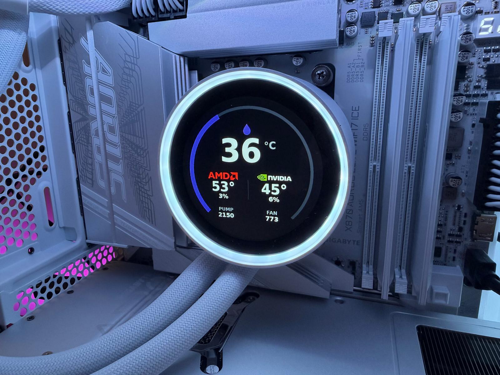
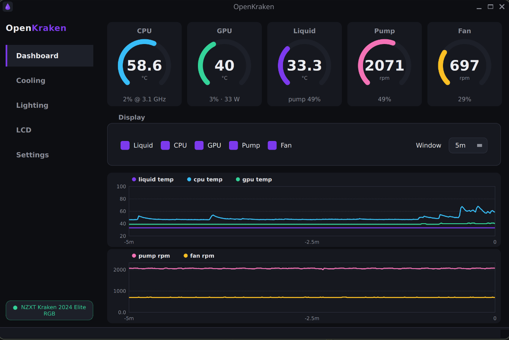
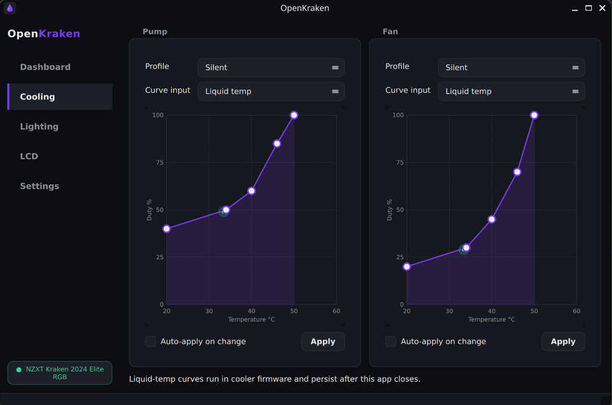
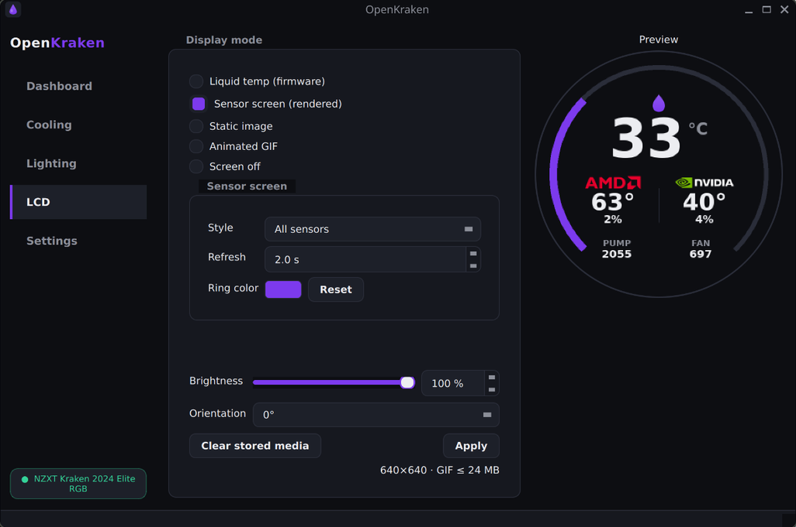
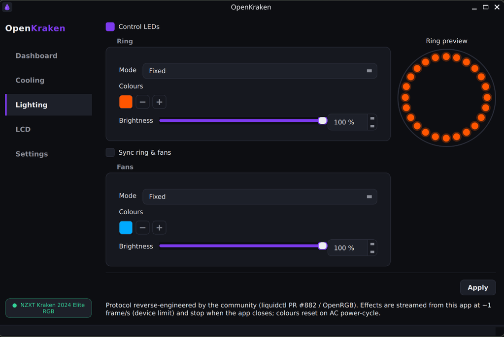

<div align="center">


<h1>OpenKraken</h1>

**NZXT Kraken control for Linux** — monitor your loop, tune firmware fan curves,<br>
and drive the round LCD, without rebooting into Windows.

[](https://github.com/davidboulay/OpenKraken/releases/latest)
[](https://davidboulay.github.io/OpenKraken/)
[](#arch-linux--omarchy--build-the-package)
[](#get-openkraken)
[](LICENSE)

[**Install**](#get-openkraken) · [Features](#features) · [Updating](#updating) · [Permissions](#permissions) · [Supported devices](#supported-devices) · [FAQ](#faq)

</div>

<br>

NZXT does not ship CAM for Linux. OpenKraken is a native **PyQt6** desktop app on
top of [**liquidctl**](https://github.com/liquidctl/liquidctl): live gauges and
graphs for your loop, pump/fan **curves that run inside the cooler's own
firmware**, live **sensor screens / images / GIFs** on the round LCD, and RGB
lighting over a community-reverse-engineered protocol.

Developed on **Pop!_OS / COSMIC** and **Omarchy / Hyprland**, both Wayland,
against a **Kraken 2024 Elite RGB**; works with any `KrakenZ3`-class cooler
liquidctl recognises, on GNOME, KDE, Hyprland and other desktops. Packaged for
both **Debian/Ubuntu** (`.deb`, APT repo) and **Arch** (`PKGBUILD`).



<sub>**The cooler itself** — a live sensor screen rendered by OpenKraken on the
640×640 LCD: liquid ring, CPU/GPU temps with vendor badges. This is the **All
sensors** style (`triple`) with [custom vendor logos](#features) in place; the
**Liquid ring** style shows the loop temperature alone, without the badges.</sub>

| Dashboard | Cooling |
| --- | --- |
|  |  |
| **LCD** | **Lighting** |
|  |  |

<sub>The AMD / NVIDIA marks on the LCD sensor screen are user-supplied logo files
(see [Custom vendor logos](#features)); OpenKraken ships none.</sub>

## Features

- **Live dashboard** — circular gauges for CPU/GPU/liquid temperature, pump and
  fan RPM, plus scrolling time-series graphs (selectable metrics, 1m/5m/10m
  windows).
- **Cooling control** — Silent / Balanced / Performance presets, fully editable
  pump and fan **curves** (drag-to-edit), or a flat fixed duty. Curves can track
  **liquid**, **CPU**, or **GPU** temperature.
  - **Liquid-temp curves run inside the cooler's firmware** and keep working
    even after OpenKraken is closed.
  - **CPU/GPU-temp curves** are driven by the app each tick, with a firmware
    failsafe baked in so a crashed app can never cook the loop.
- **LCD screen control** for the round display:
  - Firmware liquid-temp screen
  - Live **sensor screens** rendered on the host and uploaded over USB
    (multiple styles), with a configurable liquid-ring colour and
    auto-detected CPU/GPU **vendor badges** (AMD / Intel / NVIDIA)
  - **Static images** and **animated GIFs**
  - Brightness, orientation (0/90/180/270°), and a software "off"
  - Self-healing: a wedged panel (a firmware quirk this device has) is detected
    and recovered automatically — no more black screens
- **RGB lighting** (off by default) for the 24-LED pump ring and the bundled
  RGB Core fan chain: solid colours plus smooth host-streamed Breathing /
  Color cycle / Spectrum effects, with per-channel brightness. See the
  [FAQ](#faq) for how this works and its caveats.
- **In-app updates** — checks GitHub on launch (optional) and prompts with a
  desktop notification when a new version is out. What **Update now** can do
  depends on how you installed it (one click for source checkouts and `.deb`
  installs); see [Updating](#updating).
- **System tray** with quick profile switching and close-to-tray; runs in the
  background on desktops without a tray.
- **Persistent config** at `~/.config/openkraken/config.json`.

*Custom vendor logos:* the sensor screens show a stylised vendor wordmark by
default. To use official logo artwork instead, drop your own RGBA PNGs at
`~/.config/openkraken/logos/{amd,intel,nvidia}.png` — OpenKraken ships no
trademarked logos. They are scaled by **height** (badges render at ~34 px, so
~128 px tall sources downscale cleanly) and composited straight onto the panel's
near-black background — so a single-colour mark exported in black will be
invisible. Recolour it to the brand colour first (AMD's red is `#E4002B`).

## Get OpenKraken

### Ubuntu / Pop!_OS / Debian — APT repository (recommended there)

Add the repo once, then install and get updates with `apt` like any system
package:

```bash
curl -fsSL https://davidboulay.github.io/OpenKraken/openkraken.gpg | sudo tee /usr/share/keyrings/openkraken.gpg >/dev/null
echo "deb [signed-by=/usr/share/keyrings/openkraken.gpg] https://davidboulay.github.io/OpenKraken ./" | sudo tee /etc/apt/sources.list.d/openkraken.list
sudo apt update && sudo apt install openkraken
```

New versions then arrive with `sudo apt upgrade`. The repo is GPG-signed and
served over GitHub Pages. The `.deb` installs the udev rule for you — plug the
cooler (or re-plug it) and launch **OpenKraken** from your app list.

### Or grab the `.deb` directly

From the **[Releases page](https://github.com/davidboulay/OpenKraken/releases/latest)**:

```bash
gh release download --repo davidboulay/OpenKraken --pattern '*.deb'
sudo apt install ./openkraken_*.deb
```

### Arch Linux / Omarchy — build the package

Every dependency is in the official Arch repositories — including
**liquidctl ≥ 1.16**, which already knows the Kraken 2024 Elite RGB — so the
Arch package vendors nothing at all and weighs about 150 KB:

```bash
git clone https://github.com/davidboulay/OpenKraken
cd OpenKraken/packaging/arch
./build-pkg.sh --install
```

That builds `openkraken-<version>-1-any.pkg.tar.zst` with `makepkg` and installs
it with `pacman`, pulling `python-pyqt6`, `python-pillow` and `liquidctl` in as
ordinary package dependencies. Plain `makepkg -si` in the same directory does
the same thing; `./build-pkg.sh` on its own just builds into
`packaging/arch/dist/`.

The package ships the udev rule *and* re-applies it to an already-plugged
cooler, so **OpenKraken** is usable from your launcher immediately — no re-plug,
no reboot. See [Omarchy / Hyprland](#omarchy--hyprland) for optional window
rules and autostart.

### From source

```sh
git clone https://github.com/davidboulay/OpenKraken openkraken
cd openkraken
./setup.sh
```

`setup.sh` is idempotent: it creates `.venv/` (with `--system-site-packages` so
a distro PyQt6 is visible), installs the project editable, verifies the
liquidctl driver knows your Kraken (upgrading from upstream if needed), checks
device permissions (offering the udev rule if yours are missing — see
[Permissions](#permissions)), and installs an `openkraken.desktop` launcher.

Requirements are modest: Python ≥ 3.10, PyQt6 ≥ 6.4, liquidctl ≥ 1.15,
Pillow ≥ 9 — no compiled extensions in the project itself. The LCD sensor
screens also need **a bold TrueType font** on the system (DejaVu, Liberation or
Noto — both packages depend on one); without any of them Pillow falls back to a
bitmap face that is unreadable at the 210 px temperature readout.

### Run

Launch **OpenKraken** from your application menu, or from a terminal:

```sh
openkraken                  # packaged install (.deb / pacman): already on PATH
.venv/bin/openkraken        # source install
```

| Flag             | Effect                                  |
| ---------------- | --------------------------------------- |
| `--minimized`    | Start hidden (in the tray, or in the background without one) |
| `--config PATH`  | Use an alternate config file            |
| `--debug`        | Verbose (DEBUG-level) logging           |
| `--version`      | Print version and exit                  |

**Autostart on login** (for monitoring or CPU/GPU-temp curves):

```sh
mkdir -p ~/.config/autostart
# a packaged install puts the desktop entry in /usr/share/applications;
# a source install puts it in ~/.local/share/applications
cp /usr/share/applications/openkraken.desktop ~/.config/autostart/ 2>/dev/null \
  || cp ~/.local/share/applications/openkraken.desktop ~/.config/autostart/
# optionally start hidden in the tray:
sed -i 's|openkraken$|openkraken --minimized|' ~/.config/autostart/openkraken.desktop
```

This works on Hyprland/Omarchy too — `uwsm` provides
`wayland-session-xdg-autostart@.target`, so XDG autostart entries are honoured
there like anywhere else. Omarchy users who prefer to keep startup in one place
can use `o.launch_on_start("openkraken --minimized")` in
`~/.config/hypr/autostart.lua` instead.

Liquid-temp curves run inside the cooler's firmware, so if that's all you use,
the app doesn't need to be running after applying them once.

## Updating

- **APT installs** update like any package: `sudo apt upgrade`.
- **Arch installs** update by rebuilding from an updated checkout:
  `git pull && cd packaging/arch && ./build-pkg.sh --install`.
- **In-app**: with *Check for updates on launch* enabled (Settings, default on),
  OpenKraken quietly checks GitHub at startup and shows a desktop notification
  when a new version exists. **Update now** then does whatever suits how you
  installed it — the updater asks the package manager who owns its own files
  rather than guessing from `/etc/os-release`, so a source checkout on Arch is
  still correctly treated as a checkout:

  | Install         | What *Update now* does                                              |
  | --------------- | ------------------------------------------------------------------- |
  | Source checkout | `git pull --ff-only`, then restart                                   |
  | `.deb` / APT    | downloads the release `.deb`, then `pkexec apt-get install`          |
  | Arch package    | downloads a release `.pkg.tar.zst` if one exists, `pkexec pacman -U` |

  Releases currently ship a `.deb` only, so on Arch the notification reports the
  new version and points at the rebuild command instead of offering a one-click
  update. The same flow is available manually via **Settings → Check for
  updates**.

## Permissions

liquidctl talks to the cooler over raw USB HID (`/dev/hidraw*`) **and** the raw
USB device node (string descriptors at enumeration + the LCD's bulk interface).
To use it **without root**, your user needs access to both. Both packages (the
`.deb` and the Arch one) install the udev rule automatically; `setup.sh` probes
both access paths and *offers* the rule when either is missing.

To add it **manually**, create `/etc/udev/rules.d/70-openkraken.rules`. BOTH
lines are required: `hidraw` covers cooling/lighting/status, and `usb` covers
the LCD (a separate USB bulk interface) plus device enumeration itself — without
it OpenKraken fails to connect with a "no langid (permission issue...)" error.

**Debian/Ubuntu**, with the `plugdev` group as a fallback:

```udev
SUBSYSTEM=="hidraw", ATTRS{idVendor}=="1e71", TAG+="uaccess", MODE="0660", GROUP="plugdev"
SUBSYSTEM=="usb", ATTRS{idVendor}=="1e71", TAG+="uaccess", MODE="0660", GROUP="plugdev"
```

**Arch** — no `GROUP`, because Arch has no `plugdev` group, and naming a group
that does not exist makes udev log an error for every matching device:

```udev
SUBSYSTEM=="hidraw", ATTRS{idVendor}=="1e71", TAG+="uaccess"
SUBSYSTEM=="usb", ATTRS{idVendor}=="1e71", TAG+="uaccess"
```

Then reload and re-apply — no re-plug or reboot needed:

```sh
sudo udevadm control --reload-rules
sudo udevadm trigger --subsystem-match=hidraw --subsystem-match=usb
sudo usermod -aG plugdev "$USER"      # Debian only, and only for the fallback
```

`TAG+="uaccess"` is what actually grants access on any systemd-logind desktop:
logind puts an ACL on each matching node for the user of the **active local
seat**. That is also why a bare SSH session has no access even as the same user
— log in locally, or add your own `GROUP=` rule for headless control. The
`plugdev` group is only a fallback for systems without logind seat management.

## Desktops & tray

OpenKraken works on stock GNOME, KDE, COSMIC, Hyprland, and others. The one
thing that differs is the **system tray**:

- **With a tray** (KDE, COSMIC's panel applet, Omarchy's Quickshell bar, GNOME
  *with* the
  [AppIndicator/KStatusNotifierItem extension](https://extensions.gnome.org/extension/615/appindicator-support/)),
  you get the tray icon, quick profile switching, and close-to-tray.
- **Without a tray** (stock GNOME), closing the window hides it and leaves the
  control engine running (*"Keep running in background when closed"*, Settings,
  default on). **Relaunching OpenKraken reopens the window** (single-instance —
  a second launch just raises the running one). <kbd>Ctrl</kbd>+<kbd>Q</kbd>
  quits entirely.

PyQt6 ≥ 6.4 bundles the Qt Wayland platform plugin, so the app runs natively on
Wayland; if the plugin is missing Qt falls back to XWayland, which is harmless.
On Arch the plugin is a separate package — install `qt6-wayland` (an
`optdepends` of the Arch package) for native Wayland output.

### Omarchy / Hyprland

Nothing is required: OpenKraken tiles and runs fine with no configuration, its
tray icon works (Omarchy's Quickshell bar is a StatusNotifier host), and its
Wayland `app_id` is `openkraken`.

Two optional touches are shipped in
[`packaging/omarchy/openkraken.lua`](packaging/omarchy/openkraken.lua) — window
rules that float and centre the window like Omarchy's own utility windows, and
an autostart line. Omarchy configures Hyprland in **Lua**, so the rules look
like this rather than the classic `windowrule` lines:

```lua
o.window("^(openkraken)$", { float = true, center = true })
o.window("^(openkraken)$", { size = { 920, 740 } })
```

Copy what you want into `~/.config/hypr/hyprland.lua` (rules) and
`~/.config/hypr/autostart.lua` (`o.launch_on_start("openkraken --minimized")`),
then validate with `hyprctl reload && hyprctl configerrors`.

## Supported devices

Any `KrakenZ3`-class cooler that liquidctl recognises. LCD size and speed
channels are detected automatically from the driver:

| Model                         | USB id        | LCD       |
| ----------------------------- | ------------- | --------- |
| Kraken Z53 / Z63 / Z73        | `1e71:3008`   | 320×320   |
| Kraken 2023                   | `1e71:300e`   | 240×240   |
| Kraken 2023 Elite             | `1e71:300c`   | 640×640   |
| **Kraken 2024 Elite RGB**     | `1e71:3012`   | 640×640   |
| Kraken 2024 Plus              | `1e71:3014`   | 240×240   |

The non-LCD Kraken X-series and other NZXT coolers are out of scope (no screen).

## FAQ

**Does it control the RGB lighting?**
Yes — but it's **off by default**, and you should know how it works first.
Installed liquidctl exposes **no lighting protocol** for the 2023/2024 Kraken
generation (the driver's colour-channel map is empty), so OpenKraken speaks the
HUE2 "Direct" wire protocol itself. That protocol was **reverse-engineered by
the community** — credit to the unmerged [liquidctl PR #882](https://github.com/liquidctl/liquidctl/pull/882)
(`feat/kraken-2024-elite-rgb`, tested on this exact device) and to the
[OpenRGB](https://openrgb.org/) NZXT HUE2 controller and its device issues
(#4828 / #4985). There is no official NZXT spec.

What that means in practice:

- **Enable it explicitly.** The Lighting page ships with "Control LEDs"
  unchecked; until you turn it on, OpenKraken never writes to the LEDs and your
  existing (NZXT/firmware) lighting is left alone.
- **Effects are streamed from the host.** The device's firmware rejects its own
  hardware animation modes for this generation, so Breathing / Color cycle /
  Spectrum are computed by the app and streamed as Direct frames — smoothly, at
  **4 frames/s by default** (`lighting_fps` in the config, clamped 0.5–5; 5 FPS
  soak-tested on real hardware). Effects **stop when the app closes** (a solid
  colour just stays as the last frame written).
- **Brightness is applied host-side** (the device has no brightness command),
  and **colours reset on an AC power-cycle** — reopen the app (or let it
  autostart with "apply on start") to re-apply.
- Covers the **24-LED pump ring** and the bundled **RGB Core fan** chain; ring
  and fans can be synced or driven independently.

**Why is the LCD sensor screen refresh 2 s by default?**
Each rendered frame is a full-resolution bitmap uploaded over USB — roughly
**0.8 MB per frame**. To avoid saturating the link and spamming the firmware,
the **sensor screen defaults to a 2-second** refresh interval (configurable
0.5–10 s on the LCD page). Animated GIFs are limited by the firmware to an
encoded size of about **24 MB**.

**Do my fan/pump curves survive closing the app — or a reboot?**
**Liquid-temp curves** are written into the cooler's firmware as a 40-point
table and **keep running after you close OpenKraken** (and across an OS reboot,
as long as the cooler stays powered). They are **reset when the cooler loses
power** (e.g. a full AC power cycle), after which you should reopen the app (or
let it autostart with "apply on start") to re-apply them. **CPU/GPU-temp
curves** require the app to be running because the host computes the duty each
tick; a firmware failsafe still protects the loop if the app dies.

**Why isn't there an "LCD off" button that actually turns the panel off?**
The firmware has no blank mode, so "Screen off" sets brightness to 0 and
restores your previous brightness when you switch back.

**It says "Disconnected".**
Check the [permissions](#permissions) section, then confirm liquidctl itself sees
the device. Which command depends on where liquidctl lives:

```sh
python3 -m liquidctl list                                  # Arch package (real dependency)
PYTHONPATH=/usr/lib/openkraken/vendor python3 -m liquidctl list   # .deb (liquidctl is vendored)
.venv/bin/python -m liquidctl list                         # source install
```

Also make sure nothing else is holding the HID handle. On Arch, OpenRGB's udev
rules match NZXT gear too — harmless in itself, but OpenRGB *opening* the cooler
is not, so disable its NZXT detectors if you run both. Confirm who has the node
with:

```sh
grep -l 1E71 /sys/class/hidraw/*/device/uevent    # which hidrawN is the Kraken
sudo fuser -v /dev/hidrawN                        # and who has it open
```

**A setting (brightness, orientation) didn't apply, and the log says "missing
messages".**
Every `set_screen` call starts by asking the cooler for its current orientation
and brightness and reading until the reply arrives. A second process reading the
same `hidraw` node can consume that reply first, and liquidctl then raises
`AssertionError: missing messages (attempts=12, missing=1)` even though the
device is perfectly healthy. OpenKraken retries that specific case, so it
normally self-corrects; if it persists, something really is competing for the
device — most often a **second OpenKraken instance** left running. The device is
never marked disconnected for this, and the panel keeps its previous setting.

## Configuration & data

Everything lives under `~/.config/openkraken/`:

- `config.json` — all settings (cooling curves, LCD, lighting, update checks,
  `lighting_fps`, LCD self-heal intervals)
- `media/` — cached/resized LCD images and GIFs
- `logos/` — optional user-supplied vendor logo PNGs for the sensor screens
  (`amd.png`, `intel.png`, `nvidia.png`; see [Custom vendor logos](#features))

## Uninstall

- **APT / .deb:** `sudo apt remove openkraken` (add `--purge` to drop the udev
  rule too).
- **Arch:** `sudo pacman -R openkraken`. The udev rule is package-owned, so it
  goes with it and udev is reloaded by pacman's own hook.
- **Source install:**

  ```sh
  rm ~/.local/share/applications/openkraken.desktop
  rm ~/.config/autostart/openkraken.desktop   # if you added autostart
  rm -rf .venv                                 # the project's virtual environment
  rm -rf ~/.config/openkraken                  # config + cached LCD media (optional)
  # then delete the cloned project directory
  ```

  Any udev rule that was installed (`/etc/udev/rules.d/70-openkraken.rules`) can
  be removed separately with `sudo`.

## License

MIT — see [`LICENSE`](LICENSE). Each source file carries an
`SPDX-License-Identifier: MIT` header.

OpenKraken is an independent open-source project, not affiliated with or endorsed
by NZXT. "Kraken" is referenced descriptively for hardware interoperability.
"NZXT", "Kraken", and "CAM" are trademarks of their respective owners.
Built on the excellent [liquidctl](https://github.com/liquidctl/liquidctl).
